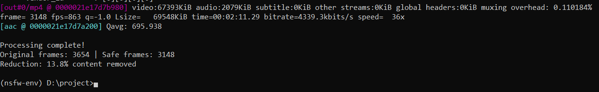

# Stream In Family Mode

 

## Project Description
A content filtering system that automatically detects and filters NSFW (Not Safe For Work) content from video streams, making them family-friendly.

## Key Features
- Real-time NSFW content detection using AI
- Automatic blurring/pixelation of inappropriate content
- Supports MP4, AVI, and MOV video formats
- Configurable sensitivity thresholds
- Lightweight and optimized for fast processing

## Technologies Used
- Python 3.8+
- TensorFlow/Keras (NSFW detection model)
- OpenCV (video processing)
- NumPy (array operations)